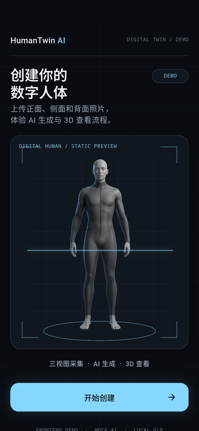

# HumanTwin AI

AI 数字人体移动端体验 Demo。

**Current Status：Day 2 Complete · 2026-08-10**

目标核心体验：

**三视图照片 → Mock AI Generation → Interactive 3D Digital Human Viewer**

本阶段计划围绕 Flutter 前端体验、Mock AI 流程和预生成本地 GLB 展开；当前不宣称已经完成真实 AI 数字人体重建。



## Current Progress

### Day 1 — Foundation & 3D Risk Validation ✅

- Product scope and six-screen user flow defined
- Figma foundation completed
- Flutter project initialized
- `model_viewer_plus` 1.10.0 validated
- Local GLB loading validated
- Rotate / Zoom / Auto Rotate validated
- Viewer re-entry 5/5
- `flutter analyze` passed
- `flutter test` passed
- Debug APK built

### Day 2 — High-Fidelity Home & Flutter App Shell ✅

- Clinical Spatial Premium visual direction established
- High-Fidelity Home completed
- Dedicated static Digital Human Hero integrated
- Flutter Material 3 Theme implemented
- Riverpod / go_router / image_picker dependencies locked
- Flutter `HomeScreen` implemented
- Home → Photo Guide placeholder route working
- SafeArea / responsive short-screen handling implemented
- `flutter analyze`: No issues found
- `flutter test`: 4/4 passed
- Day 1 Viewer regression tests still passing
- Debug APK built
- Day 2 Figma / GitHub / Notion / acceptance video archived

## Demo Evidence

- [Figma · 06 App UI｜正式界面](https://www.figma.com/design/JN4IsUqG7tLuwqcGbjbd1k/HumanTwin-AI-Demo?node-id=151-3)
- [Figma formal workspace screenshot](docs/evidence/day-2/app-ui-formal-workspace.png)
- [Approved Home area screenshot](docs/evidence/day-2/app-ui-home-approved.png)
- [Flutter Home screenshot](docs/evidence/day-2/home-android-390x844.png)
- [Day 2 delivery demo](artifacts/day-2/02-home-delivery-demo.mp4)
- [Day 2 cold-start acceptance video](artifacts/day-2/01-home-flutter-demo.mp4)
- [Day 1 Viewer acceptance screenshot](artifacts/day-1/08-final-viewer.png)
- [Day 1 Viewer demo](artifacts/day-1/07-viewer-demo.mp4)

## Demo Boundary

当前是 **Frontend Experience Demo**。

已经完成：

- Flutter UI 与 High-Fidelity Home
- Material 3 Theme 和最小 `go_router` App Shell
- Home → Photo Guide 占位路由
- 预生成本地 GLB Viewer POC
- Local GLB interactive Viewer

尚未完成：

- Real three-view photo selection
- Real AI human reconstruction
- Production backend API
- Cloud storage
- User accounts
- Medical / health analysis

本项目当前不是 Production Ready，也不表示三张照片已经生成真实 3D 数字人体。

## Technical Baseline

- Flutter 3.44.9 stable
- Dart 3.12.2
- Material 3
- `flutter_riverpod` 3.3.2
- `go_router` 17.3.0
- `image_picker` 1.2.3
- `model_viewer_plus` 1.10.0
- Android minSdk 24
- 验证模拟器：`HumanTwin_API_36`（Android 16 / API 36）

## Run Locally

```bash
flutter pub get
flutter emulators --launch HumanTwin_API_36
flutter devices
flutter run -d emulator-5554
```

模拟器设备 ID 可能变化；以 `flutter devices` 的输出为准。

## Validation

```bash
dart format --output=none --set-exit-if-changed lib test
flutter test --no-pub
flutter analyze --no-pub
flutter build apk --debug --no-pub
```

## Key Files

- `lib/app/app.dart`：Material App 与 Home / Photo Guide 路由
- `lib/app/theme/app_theme.dart`：正式颜色、Typography、Spacing 与 Radius Token
- `lib/features/home/home_screen.dart`：Day 2 High-Fidelity Home
- `lib/features/capture/photo_guide_screen.dart`：Day 2 路由验收占位页
- `lib/main.dart`：App 入口及保留的 Day 1 Viewer POC
- `test/viewer_poc_test.dart`：Home、路由与 Viewer regression tests
- `assets/images/digital_human_hero.png`：本地静态 Digital Human Hero
- `assets/models/human_demo.glb`：本地 Viewer 测试模型

## Viewer Notes

`model_viewer_plus` 在移动端通过本地 loopback HTTP 服务向 WebView 提供资源。项目没有全局开放 cleartext，而是通过 Network Security Config 仅允许 `localhost` 和 `127.0.0.1`，其他 cleartext 流量仍被拒绝。

`human_demo.glb` 使用 Khronos glTF Sample Assets 中的 RiggedFigure，采用 CC BY 4.0 许可。完整来源和署名见 [THIRD_PARTY_NOTICES.md](THIRD_PARTY_NOTICES.md)。

## Roadmap

- Day 1 ✅ — Foundation + 3D Viewer POC
- Day 2 ✅ — High-Fidelity Home + Flutter App Shell
- Day 3 — Photo Guide + Shared Components
- Day 4 — Three-view Photo Selection + `image_picker`
- Day 5 — Photo Confirmation + State Retention
- Day 6 — Mock AI Processing
- Day 7 — Full Viewer Integration
- Day 8 — Android Physical Device Validation
- Day 9 — QA + Scope Freeze
- Day 10 — Release Delivery
