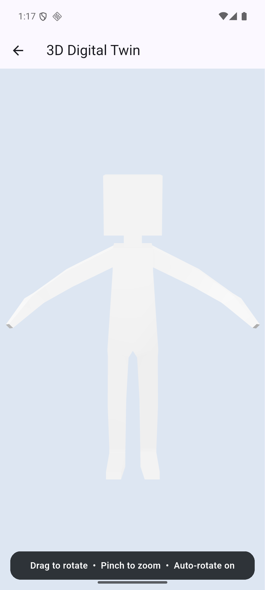

# HumanTwin AI — Day 1 3D Viewer POC

这是 HumanTwin AI 第一阶段的 Android 3D Viewer 技术验证项目。当前版本只验证 Flutter、`model_viewer_plus` 和本地 GLB 在 Android 模拟器中的可用性与稳定性，不包含 Day 2 的正式应用架构或业务流程。

## 已验证能力

- 从 Flutter asset 加载本地 GLB 模型
- 手势旋转与缩放
- 自动旋转
- 退出 Viewer 后重新进入
- Android WebView 本地资源加载
- Android debug APK 构建



[查看 Day 1 操作录屏](artifacts/day-1/07-viewer-demo.mp4)

## 环境基线

- Flutter 3.44.9 stable
- Dart 3.12.2
- Android minSdk 24
- 验证设备：`HumanTwin_API_36`（Android 16 / API 36）
- `model_viewer_plus` 1.10.0

## 运行方式

```bash
flutter pub get
flutter emulators --launch HumanTwin_API_36
flutter devices
flutter run -d emulator-5554
```

模拟器设备 ID 可能变化；以 `flutter devices` 的输出为准。

## 验证命令

```bash
dart format --output=none --set-exit-if-changed lib test
flutter test --no-pub
flutter analyze --no-pub
flutter build apk --debug --no-pub
```

## 关键文件

- `lib/main.dart`：最小 Launcher 与 3D Viewer
- `test/viewer_poc_test.dart`：Viewer 配置及重复进入测试
- `assets/models/human_demo.glb`：本地测试模型
- `android/app/src/main/res/xml/network_security_config.xml`：仅允许 `localhost` 和 `127.0.0.1` 的 cleartext 流量
- `THIRD_PARTY_NOTICES.md`：测试模型来源与许可说明
- `docs/daily-reports/2026-08-09.md`：Day 1 验收日报

## Android 配置说明

`model_viewer_plus` 在移动端通过本地 loopback HTTP 服务向 WebView 提供资源。项目没有全局开放 cleartext，而是通过 Network Security Config 仅允许 `localhost` 和 `127.0.0.1`，其他 cleartext 流量仍被拒绝。

## 测试模型

`human_demo.glb` 使用 Khronos glTF Sample Assets 中的 RiggedFigure，采用 CC BY 4.0 许可。完整来源和署名见 [THIRD_PARTY_NOTICES.md](THIRD_PARTY_NOTICES.md)。

## 当前范围

Day 1 POC 已完成。Riverpod、go_router、Welcome、上传、Mock Processing 和正式业务结构均未在本次实现中提前加入。
